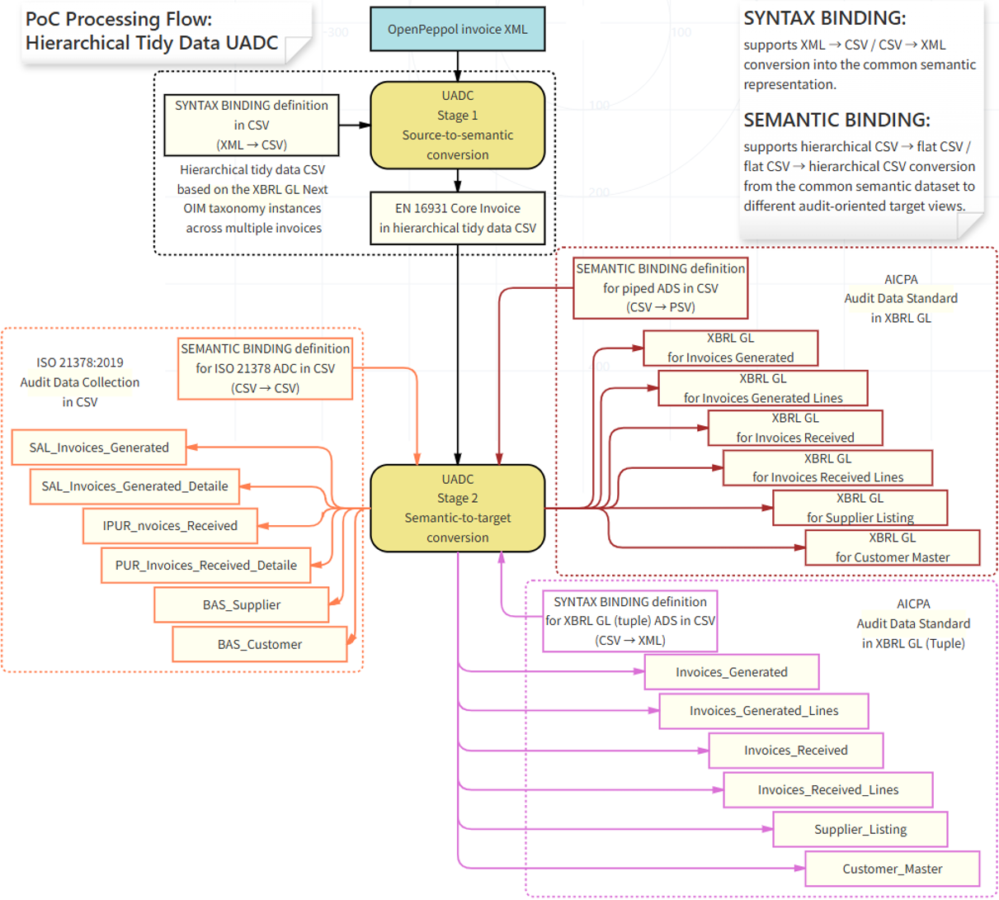

# UADC PoC Collaboration Workspace

This workspace is for the xBRL-GL Next / UADC proof of concept. It implements the UADC processing model for "A Hierarchical Tidy Data Universal Audit Data Converter for Invoice Reuse".

The proposal defines UADC as a Universal Audit Data Converter that uses hierarchical tidy data as a common semantic representation. The target architecture separates source syntax conversion from downstream audit-view generation:

- syntax binding maps source invoice XML into a common EN 16931 / XBRL GL Next semantic layer;
- the common semantic layer preserves document-level invoice information, parties, tax subtotals, invoice lines, identifiers, dates, currencies, and monetary amounts;
- semantic binding then projects the common dataset into downstream audit views, including ISO 21378:2019 Audit data collection Sales/Purchase invoice views and AICPA ADS O2C/P2P invoice views.

This repository is the working implementation space for that proposal. The current implementation includes the Phase 1 Structured CSV baseline and the first Phase 2 ADS XBRL GL target projections.

The first PoC checkpoint is the EN 16931-1 invoice semantic model represented as an LHM/HMD-style CSV, plus binding-driven conversion from UBL Invoice XML to structured CSV, xBRL-CSV JSON metadata, and round-trip UBL Invoice XML.

OpenPeppol BIS Billing is handled as the next layer: a CIUS/profile overlay on top of EN 16931-1, with additional constraints, defaults, and syntax-specific rules.

## Clone And Setup Overview

After cloning the GitHub repository, use this sequence to prepare a local execution and development environment.

Windows PowerShell:

```
git clone https://github.com/pontsoleil/UADC-PoC.git
cd .\UADC-PoC
$python = 'python'
& $python --version
```

macOS / Linux shell:

```
git clone https://github.com/pontsoleil/UADC-PoC.git
cd ./UADC-PoC
PYTHON=python3
$PYTHON --version
```

In PowerShell, **$python = 'python'** is a variable assignment and **& $python ...** uses PowerShell's call operator to run that command. In macOS/Linux shells, use **PYTHON=python3** and run commands as **$PYTHON ...** without **&**. If Python is not on **PATH**, set the variable to the full local Python executable path instead.

If this repository is checked out inside a larger workspace, enter the PoC directory instead:

```
cd <local-clone-directory>\UADC-PoC
```

Then prepare generated local files and test artifacts:

Windows PowerShell:

```
& $python -m py_compile .\src\syntax_binding.py .\tools\build_roundtrip_test_artifacts.py .\tools\taxonomy\xBRLGL_TaxonomyGenerator.py
& $python .\tests\test_xbrlgl_generator_uadc_lhm.py
& $python .\tools\build_roundtrip_test_artifacts.py
& $python .\tests\test_roundtrip_artifacts.py
```

macOS / Linux shell:

```
$PYTHON -m py_compile ./src/syntax_binding.py ./tools/build_roundtrip_test_artifacts.py ./tools/taxonomy/xBRLGL_TaxonomyGenerator.py
$PYTHON ./tests/test_xbrlgl_generator_uadc_lhm.py
$PYTHON ./tools/build_roundtrip_test_artifacts.py
$PYTHON ./tests/test_roundtrip_artifacts.py
```

This creates the local xBRL-CSV taxonomy under **out/taxonomy/** and refreshes reviewable round-trip artifacts under **tests/roundtrip/**.

For the full initial setup and continuing development test workflow, see **docs/development/README.md**. For conversion internals and day-to-day test commands, see **docs/README_SCRIPT_PROCESSING.md** and **docs/testing/README.md**.

## Figure 1



Figure 1 from the proposal shows the intended UADC processing flow. Phase 1 covers the source-to-semantic path from OpenPeppol/UBL Invoice XML to EN 16931 hierarchical tidy data, structured CSV, JSON metadata, taxonomy validation, and round-trip XML. Phase 2 extends the same semantic layer toward ISO 21378 and AICPA ADS target views through semantic binding.

## UADC Processing Steps

The phases below describe the UADC processing model, not project management milestones.

| Phase | Processing Step | Main Inputs And Outputs | Current Status |
| --- | --- | --- | --- |
| Phase 1 | Create a generic Structured CSV from source invoice syntaxes. | Input starts with Peppol UBL Invoice XML. The source syntax binding maps invoice facts into the common EN 16931 / UADC hierarchical Structured CSV. The same phase writes xBRL-CSV metadata JSON and validates the generic representation against the generated xBRL-CSV taxonomy. | Current repository baseline. Peppol UBL input, Structured CSV generation, metadata JSON generation, and UBL round-trip checks are functioning. |
| Phase 2 | Convert the generic Structured CSV into purpose-specific common formats. | The generic Structured CSV becomes the reusable source for target formats such as Peppol Invoice, UN/CEFACT Invoice, XBRL GL invoice, ISO 21378 Sales/Purchase invoice views, and AICPA ADS O2C/P2P invoice views. | Planned next step after the generic Structured CSV baseline is stable. |
| Phase 3 | Expand supported input syntaxes and interoperability tests. | Add UN/CEFACT Invoice and XBRL GL invoice examples as additional source inputs, alongside Peppol UBL. Add corresponding output conversions to Peppol Invoice, UN/CEFACT Invoice, and XBRL GL invoice. | Future direction. The later test target includes XBRL GL profiles being discussed in Finland and Estonia. |

Phase 1 intentionally focuses on the neutral intermediate representation: a generic, hierarchical Structured CSV that can be validated and round-tripped. Phase 2 uses that common representation as the source for multiple downstream formats. This separation is the core UADC idea: source syntax conversion is kept separate from target-format projection.

## Processing Flow

```
Phase 1 source syntax conversion
  Peppol UBL Invoice XML
  future: UN/CEFACT Invoice, XBRL GL invoice
    -> syntax binding
    -> generic EN 16931 / UADC Structured CSV
    -> xBRL-CSV metadata JSON
    -> taxonomy and metadata validation
    -> round-trip validation back to source syntax where supported

Phase 2 target-format projection
  generic EN 16931 / UADC Structured CSV
    -> semantic binding / target binding
    -> Peppol Invoice
    -> UN/CEFACT Invoice
    -> XBRL GL invoice
    -> ISO 21378 Sales/Purchase invoice views
    -> AICPA ADS O2C/P2P invoice views

Later interoperability tests
  -> XBRL GL invoice examples and profiles
  -> Finland and Estonia XBRL GL discussion targets
```

## Directory Layout

- **docs/** - Human-readable project documentation. Start with **docs/README.md**. Script processing is explained in **docs/README_SCRIPT_PROCESSING.md**; binding table definition rules in **docs/bindings/README.md**; specification CSV roles in **docs/specifications/README.md**; syntax binding conversion in **docs/syntax_binding_conversion/**; semantic binding conversion in **docs/semantic_binding_conversion/**; setup and tool usage in **docs/development/README.md**; test and round-trip procedures in **docs/testing/README.md**; sample and reference files in **docs/repository_files/README.md**; and design decisions in **docs/decisions/**.
- **references/** - External source notes and links used to interpret standards, source specifications, and implementation references. Keep large licensed source documents outside the repository and record only reproducible notes or pointers here.
- **specs/lhm/** - LHM/HMD semantic model definitions for the EN 16931 invoice PoC. The generated/current CSV is stored here, while **specs/lhm/source/** keeps the editable source CSV used to regenerate or adjust the LHM. Local reviewer workbooks are ignored by Git.
- **specs/bindings/** - Binding definitions. The active UBL Invoice syntax binding is **specs/bindings/syntax/EN16931_UBL_Invoice_Syntax_Binding.csv**; it maps LHM semantic paths to UBL XPath expressions and selector predicates used by forward and reverse conversion. Phase 2 ADS XBRL GL binding CSV files and the review workbook **specs/bindings/syntax/ADS_XBRL_GL_Bindings.xlsx** define the target projections shown in Figure 1.
- **samples/input/** - Small sample input files committed for baseline checks, including the minimal UBL Invoice sample and selected BIS Billing example invoices.
- **samples/expected/** - Checked expected output for lightweight regression checks where a stable expected artifact is useful.
- **src/** - Operational conversion scripts and beginner tutorial wrappers. The main converter is **src/syntax_binding.py**; it generates hierarchical Structured CSV, writes xBRL-CSV metadata JSON, and performs Structured-CSV-to-XML round trips. **src/syntax_binding_ads_xbrl_gl.py** generates the Phase 2 ADS XBRL GL target instances, and **src/tutorial/** provides simple learning scripts.
- **tests/** - Regression checks and generated round-trip review artifacts. **tests/roundtrip/** keeps source XML, structured CSV, xBRL-CSV metadata JSON, and regenerated XML side by side for review.
- **tools/** - Initial setup, supporting generation, environment-maintenance, and development helper tools. This includes the round-trip artifact builder **tools/build_roundtrip_test_artifacts.py**, tutorial/sample converters, LHM and binding maintenance scripts, and the local taxonomy generator in **tools/taxonomy/**.
- **out/** - Generated local output, ignored by Git. This includes taxonomy output, structured CSV output, reverse-conversion output, temporary caches, and rendered document QA artifacts.

The taxonomy generator is included at **tools/taxonomy/xBRLGL_TaxonomyGenerator.py**. The generated xBRL-CSV taxonomy entry point is **out/taxonomy/plt/plt-oim-2026-07-05.xsd**. Tuple/content taxonomy schemas such as **plt-all-<version>.xsd** and **en16931-content-<version>.xsd** are not generated for this PoC.

## Current Scope

1. Define and audit the EN 16931 invoice LHM used by the generic Structured CSV.
2. Convert Peppol UBL Invoice XML into the generic UADC Structured CSV.
3. Generate xBRL-CSV metadata that references the **plt-oim** taxonomy entry point.
4. Validate generated xBRL-CSV metadata with Arelle.
5. Reconstruct UBL Invoice XML from Structured CSV and validate it with UBL 2.1 schemas.
6. Generate Phase 2 ADS XBRL GL target views from the Phase 1 Structured CSV. The current ADS XBRL GL outputs are written under **out/phase2/ADS_XBRL_GL/<structured-csv-stem>/** as **Invoices_Received.xbrl**, **Invoices_Generated.xbrl**, **Invoices_Received_Lines.xbrl**, **Invoices_Generated_Lines.xbrl**, **Supplier_Listing.xbrl**, and **Customer_Master.xbrl**.
7. Keep OpenPeppol BIS Billing as the first CIUS/profile layer on top of the EN 16931 baseline.
8. Prepare the design for additional source inputs: UN/CEFACT Invoice and XBRL GL invoice examples.
9. Prepare additional target-format projections from the generic Structured CSV to Peppol Invoice, UN/CEFACT Invoice, and XBRL GL invoice.

## Tasks

1. Define the LHM for the generic Structured CSV. The LHM describes the EN 16931 invoice business terms as a hierarchy. It includes semantic paths, effective **lhm_level** values, and syntax binding references. The first syntax binding maps Peppol UBL Invoice XML into this neutral Structured CSV representation.

2. Define the xBRL-CSV taxonomy for the LHM. The taxonomy generator reads the LHM CSV and emits the EN 16931 module schema plus the **plt-oim** xBRL-CSV taxonomy schema and definition linkbase. Hypercubes, dimensions, and primary items are derived from the effective LHM hierarchy. The generated taxonomy is checked with Arelle using **out/taxonomy/plt/plt-oim-2026-07-05.xsd** as the entry point.

3. Convert XML instances to structured CSV with JSON metadata. The syntax binding converter reads a Peppol UBL Invoice XML instance, applies the LHM XPath bindings, and writes a hierarchical Structured CSV. At the same time it writes xBRL-CSV JSON metadata that links CSV dimensions and fact columns to the generated taxonomy. The JSON metadata is validated with Arelle **loadFromOIM**.

4. Perform round trip conversion from structured CSV to XML instances. The reverse conversion reads the structured CSV and the same LHM/syntax binding definitions, reconstructs a UBL Invoice XML instance, and adds required syntax support values where needed for UBL schema validity. The resulting XML is checked with an XML parser and UBL 2.1 schema validation.

5. Add additional source syntaxes after the Peppol UBL baseline is stable. Planned source inputs include UN/CEFACT Invoice and XBRL GL invoice examples. These should map into the same generic Structured CSV wherever the semantic model overlaps.

6. Add target-format projections from the generic Structured CSV. Planned outputs include Peppol Invoice, UN/CEFACT Invoice, XBRL GL invoice, ISO 21378 Sales/Purchase invoice views, and AICPA ADS O2C/P2P invoice views. Later XBRL GL testing should include profiles being discussed in Finland and Estonia.

The resulting artifacts are therefore checked at two levels: xBRL-CSV reports and taxonomy are verified with Arelle, while regenerated XML instances are verified with XML parsing and UBL schema validation.

## Current Tests

```
& $python .\tests\test_xbrlgl_generator_uadc_lhm.py
& $python .\tests\validate_taxonomy.py
& $python .\tests\test_openpeppol_invoice_conversion.py
& $python .\tests\test_bis_billing3_examples_conversion.py
& $python .\tests\test_roundtrip_artifacts.py
& $python .\tests\test_xbrl_csv_metadata_arelle.py
& $python .\tests\test_ads_invoices_received_xbrl_gl.py
& $python .\tests\test_ads_invoices_generated_xbrl_gl.py
& $python .\tests\test_ads_invoices_received_lines_xbrl_gl.py
& $python .\tests\test_ads_invoices_generated_lines_xbrl_gl.py
& $python .\tests\test_ads_supplier_listing_xbrl_gl.py
& $python .\tests\test_ads_customer_master_xbrl_gl.py
```

The sample UBL Invoice XML and BIS Billing examples are converted using **specs/bindings/syntax/EN16931_UBL_Invoice_Syntax_Binding.csv**. OpenPeppol CIUS checks are added after the EN 16931 conversion baseline is stable.

Semantic path elements are generated from Business Terms using **lowerCamelCaseConcatenated**, for example:

```
Invoice issue date -> invoiceIssueDate
Seller postal address -> sellerPostalAddress
```

