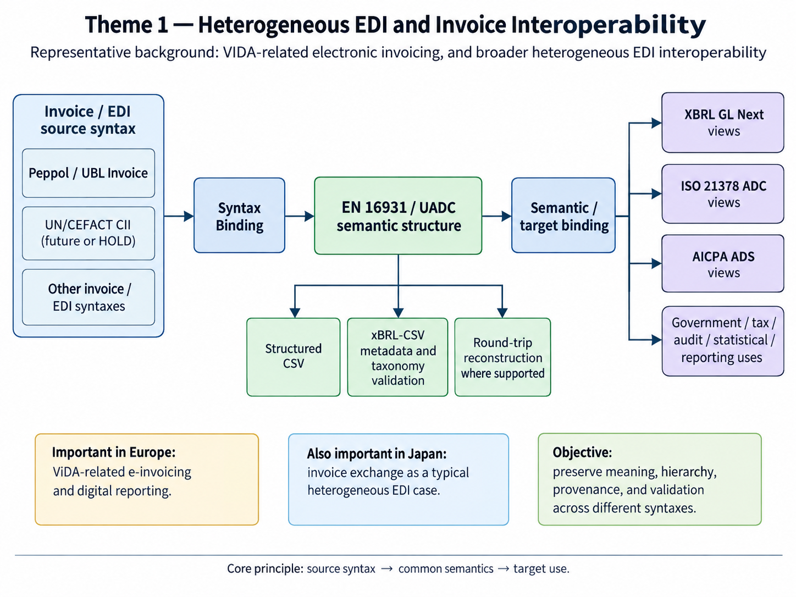
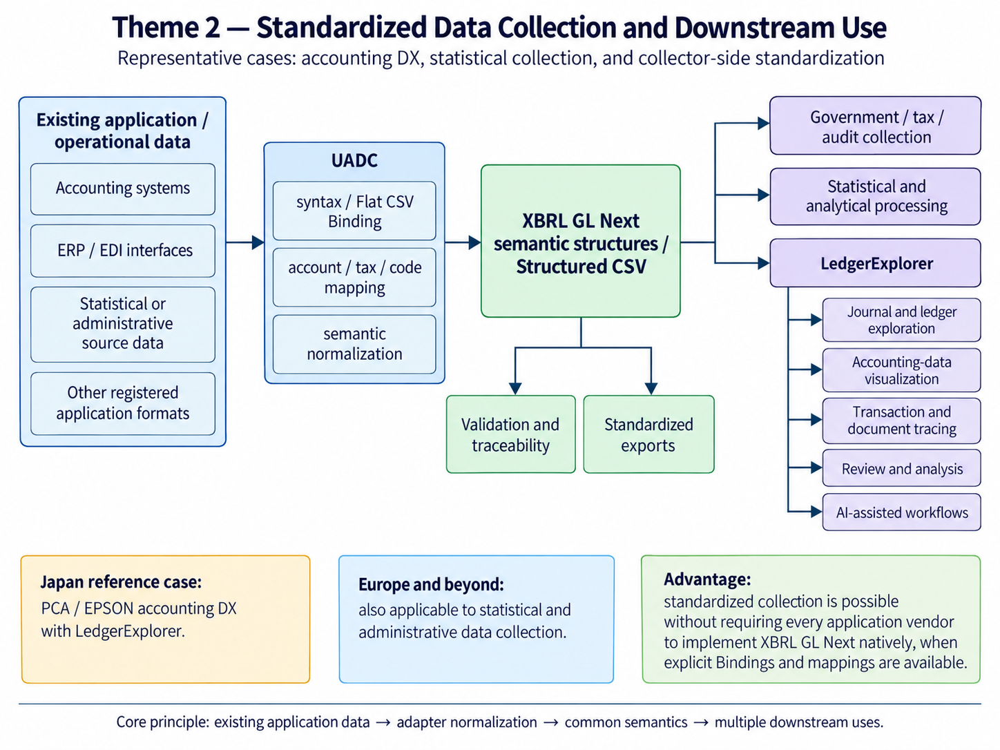
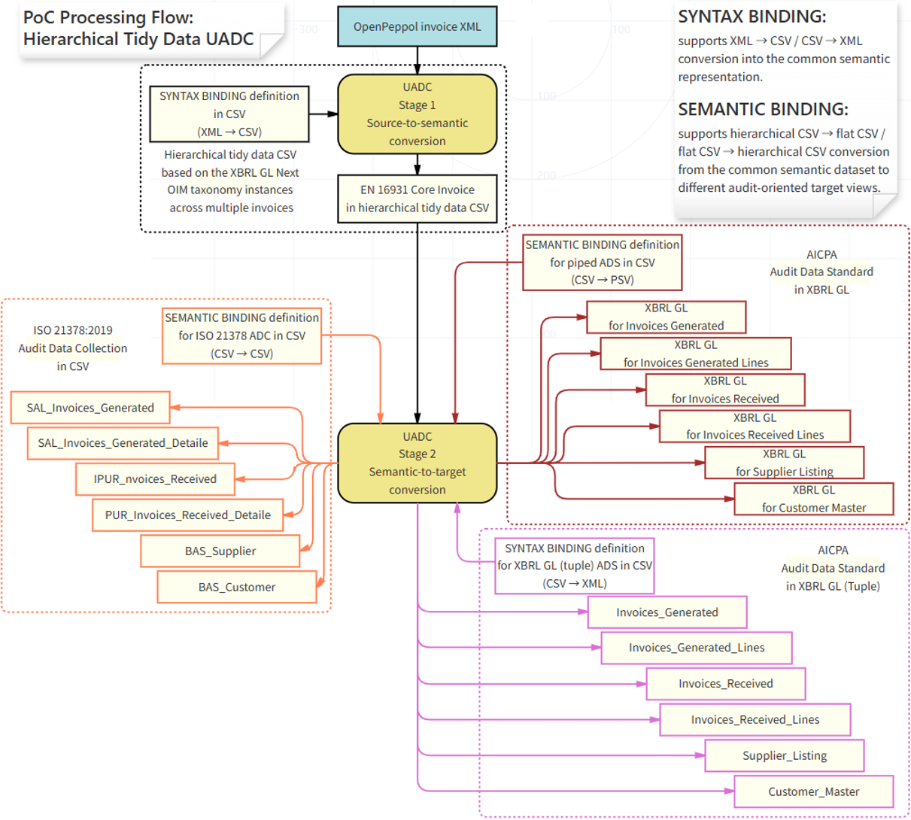

**Language:** English | [日本語](README_ja.md)

# UADC PoC Collaboration Workspace

This repository is the collaboration and implementation workspace for the **UADC (Universal Adapter for Data Conversion)** proof of concept and its relationship with **XBRL GL Next**.

UADC separates business semantics from source-system syntax. Source-specific formats are connected to common semantic and Structured CSV representations through explicit Binding definitions so that validation, reporting, audit, analysis, visualization, and other downstream uses do not need to depend directly on proprietary application formats.

UADC-PoC and the bundled XBRL GL Next taxonomy are prototype project artefacts, not official specifications. The accepted taxonomy families use XBRL Japan namespace URIs, but that use does not imply approval, endorsement, or official publication by XBRL Japan or XBRL International. See the [XBRL GL source notice](taxonomy/NOTICE_XBRL_GL.md), [licence scope](LICENSE-SCOPE.md), [third-party notices](THIRD_PARTY_NOTICES.md), and the [publication and namespace decision](docs/decisions/ADR-XBRL-GL-NEXT-PROTOTYPE-TAXONOMY-PUBLICATION.md).

## Project Entry Points

- [Current baseline](docs/CURRENT_BASELINE.md)
- [Handoff and next work](docs/HANDOFF.md)
- [Specifications](Specifications/README.md)
- [Runtime programs](tools/binding/README.md)
- [Taxonomy generator](tools/taxonomy/README.md)
- [Registered runtime cases](tests/runtime/README.md)
- [License scope](LICENSE-SCOPE.md)
- [Third-party notices](THIRD_PARTY_NOTICES.md)
- [XBRL GL source notice](taxonomy/NOTICE_XBRL_GL.md)
- [LedgerExplorer](https://github.com/pontsoleil/LedgerExplorer)

## Two Application Themes

The UADC architecture is being validated through two major application themes. These are **not regional tracks**: both themes are relevant in Europe, Japan, and other jurisdictions. Europe and Japan currently provide different concrete drivers and reference cases, but the underlying UADC architecture is shared.

### Theme 1 — Heterogeneous EDI and Invoice Interoperability

The **Invoice PoC remains a central UADC use case**.

In Europe, an important background is the move toward electronic invoicing and digital reporting, including ViDA-related environments. This makes the reuse of standardized invoice and accounting information for government and tax-authority data collection, audit, and interoperability particularly significant.

This does **not** imply that UADC or XBRL GL Next is an official ViDA specification or implementation profile.

The same theme is also important in Japan. Invoice exchange is a representative case of heterogeneous EDI: multiple syntaxes, profiles, legacy interfaces, and application-specific formats may coexist even when the underlying business meaning is substantially the same. UADC therefore treats invoice conversion as a general interoperability problem rather than as a Europe-only use case.

The Invoice PoC demonstrates how source invoice syntaxes can be mapped through a common semantic layer into reusable Structured CSV and XBRL representations.

### Theme 1 Architecture



The goal is not merely invoice-format conversion. The PoC demonstrates how meaning, hierarchy, provenance, and validation can remain stable while source and target syntaxes change. This principle is applicable wherever heterogeneous EDI formats must be reconciled without forcing all participating systems to adopt one physical syntax.

### Theme 2 — Standardized Data Collection and Downstream Use

The second theme is broader than accounting DX in one country. UADC is intended to provide an adapter layer between existing application data and standardized XBRL GL Next / Structured CSV representations that can be reused for accounting, tax, audit, statistical, analytical, and other data-collection purposes.

In Japan, a concrete reference case is accounting DX for tax accountants, accounting practices, and organizations using systems such as PCA and EPSON. Their data can be converted into a common semantic representation and supplied to downstream applications such as **LedgerExplorer**.

In Europe, the same architectural pattern is relevant not only to accounting data but also to the collection of statistical and other administrative or business data where XBRL GL Next semantics can be applied. A practical advantage of the UADC approach is that a data collector does not necessarily have to require every source-application vendor to implement XBRL GL Next natively. Where an explicit Binding and mapping can be defined, UADC can normalize existing exports or interfaces into the shared semantic layer.

### Theme 2 Architecture



This approach separates responsibilities:

- **Source applications** can continue to expose their existing interfaces unless a native standard interface is desirable.
- **UADC** converts heterogeneous source-system formats into standardized semantic data through explicit Bindings and mappings.
- **Structured CSV / XBRL GL Next** provides the common interchange and preservation layer.
- **Data-collection and analytical systems** can consume the standardized layer without requiring every source vendor to implement the same target interface.
- **LedgerExplorer** is the principal reference downstream application for the current accounting-data use case, not the boundary of the theme itself.

The current canonical provenance registers `anonymous_v17` as a PCA → Structured CSV route with LedgerExplorer and EPSON as downstream uses. That fixture validates the current accounting-oriented reference route. Broader statistical or administrative collection scenarios are architectural application areas and are not claimed as accepted runtime implementations unless separately registered and validated.

## Current Canonical Baseline

The canonical publication tree was reconstructed on **2026-09-19**. The repository root is the canonical publication tree; there is no nested `canonical/`, `transformations/`, or `legacy/` directory in the published branch.

The current canonical structure includes:

- runtime programs under `tools/binding/`;
- Binding and mapping definitions under `bindings/`;
- XBRL GL Next semantic models under `models/`;
- accepted Business Transactions and Accounting Entries taxonomy families under `taxonomy/`;
- accepted fixtures under `instances/`;
- registered runtime cases under `tests/runtime/`;
- maintained specifications under `Specifications/`.

The canonical Flat CSV Binding uses the accepted **16-column contract**. A 17-column file is accepted only as legacy-compatible input and is normalized to the 16-column runtime contract. Selectors are carried in `semantic_path` or `syntax_path` as applicable, while the canonical HMD `semantic_path` remains occurrence-neutral.

### Current `anonymous_v17` accounting fixture

The current PCA/EPSON interoperability fixture is `anonymous_v17`.

```text
PCA anonymous_v17
  -> Structured CSV anonymous_v17
     +-> LedgerExplorer
     +-> EPSON anonymous_v17
```

The registered canonical locations are:

- PCA source: `instances/original/PCA/anonymous_v17/PCA.csv`
- Structured CSV: `instances/derived/PCA/anonymous_v17/structured.csv`
- EPSON derivative: `instances/derived/EPSON/anonymous_v17/EPSON.csv`

`original_basis` and `evaluation_v17_basis` remain separate historical fixture identities and are not replaced by this registration.

### Declared HOLD items

The current baseline does **not** treat the following items as accepted PASS results:

- CII forward/reverse conversion without a complete accepted exact execution set;
- dedicated OIM-to-Tuple and Tuple-to-OIM execution manifests;
- EPSON-to-PCA reverse conversion;
- preservation of PCA explicit tax amounts in the EPSON route;
- EPSON real-application import acceptance.

These HOLD items do not invalidate accepted routes within their explicitly declared scopes.

## Project Charter

This PoC is an implementation and validation project for the **XBRL GL Next Requirements Specification** and the companion **XBRL GL Next Taxonomy Framework**. Its purpose is to turn framework requirements into executable bindings, semantic models, serialisations, transformations, and repeatable tests.

The project follows these principles:

- semantics are primary and are separated from any single serialisation;
- the semantic model is layered as FSM (Foundational Semantic Model), BSM (Business Semantic Model), and LHM (Logical Hierarchical Model);
- deterministic processing derives serialisation-ready structures from constrained semantic models;
- XBRL GL Next acts as a core semantic dataset for a Universal Adapter connecting EDI, ERP, accounting, audit, tax, statistical, and reporting systems;
- the same semantics can be realised through XBRL 2.1 palette taxonomies and OIM-based serialisations, including xBRL-CSV;
- source-system-specific syntax is isolated through Binding definitions;
- local extensions must not silently redefine common meanings;
- source-system conversion and downstream presentation are separate responsibilities.

The governing draft document set reviewed for this charter consists of:

1. **XBRL GL Next — Requirements Specification**
2. **XBRL GL Next Taxonomy Framework — Part 1: General rules**
3. **XBRL GL Next Taxonomy Framework — Part 2: XBRL 2.1 palette taxonomy**
4. **XBRL GL Next Taxonomy Framework — Part 3: xBRL-CSV palette taxonomy**
5. **XBRL GL Next Taxonomy Framework — Part 4: Aligned pool for extension**
6. **XBRL GL Next Taxonomy Framework — How to extend the taxonomy**

The source document set is maintained outside this UADC-PoC publication tree. It is a framework reference, not automatically a distributable project artifact.

## Invoice PoC Processing Model

The original UADC Invoice PoC demonstrates hierarchical tidy data as a common semantic representation. The target architecture separates source syntax conversion from downstream audit-view generation.

- syntax binding maps source invoice XML into a common EN 16931 / XBRL GL Next semantic layer;
- the common semantic layer preserves document-level invoice information, parties, tax subtotals, invoice lines, identifiers, dates, currencies, and monetary amounts;
- semantic binding projects the common dataset into downstream views such as ISO 21378 ADC and AICPA ADS;
- source and target interface files may remain organization-specific while the common semantic structure remains stable.

ADS and ISO 21378 ADC assume a wider ERP environment. An invoice alone cannot populate every audit-data field. The PoC therefore distinguishes information derivable from invoice data from information that must come from ledgers, master data, workflow logs, or other operational systems.

OpenPeppol BIS Billing is treated as a CIUS/profile layer on top of the EN 16931 baseline, with additional constraints, defaults, and syntax-specific rules.

The CII development route remains HOLD until accepted input, reverse output, and complete execution evidence can be reconstructed from preserved evidence.

## UADC Processing Steps — Invoice Theme

The phases below describe the Invoice PoC processing model, not project-management milestones.

| Phase | Processing Step | Main Inputs And Outputs | Current Status |
| --- | --- | --- | --- |
| Phase 1 | Create a generic Structured CSV from source invoice syntax. | Peppol UBL Invoice XML → syntax binding → EN 16931 / UADC Structured CSV → xBRL-CSV metadata and taxonomy validation → supported round trip. | **Complete for the accepted PoC baseline.** |
| Phase 2 | Convert the generic Structured CSV into purpose-specific common formats. | Structured CSV → ADS XBRL GL, ADS PSV, and ISO 21378 ADC invoice views. | **Complete for the declared PoC scope.** |
| Phase 3 | Expand source syntaxes and interoperability tests. | Add UN/CEFACT CII and other invoice/XBRL GL examples and corresponding reverse routes. | **HOLD / future work where complete accepted execution evidence is not registered.** |

Phase 1 focuses on the neutral intermediate representation. Phase 2 reuses that representation for multiple downstream formats. This separation is a core UADC principle.

## UADC Processing Steps — Standardized Data Collection Theme

This theme applies the same architectural separation to application and operational data collection. The currently registered implementation examples focus on accounting data, while the architecture is intended to support other collection domains where suitable XBRL GL Next semantics and Bindings are defined.

| Step | Processing Step | Current Role |
| --- | --- | --- |
| 1 | Read application-specific data using a registered profile and Binding. | PCA and EPSON are the current principal implemented accounting interfaces; other application and collection interfaces can follow the same pattern. |
| 2 | Normalize application-specific codes, dimensions, classifications, and transaction representations. | Mapping definitions remain separate from the semantic model. |
| 3 | Materialize the applicable XBRL GL Next semantic structure as Structured CSV. | Accounting Entries is the current principal implemented reference route; other collection structures require their own accepted models and evidence. |
| 4 | Validate accepted round-trip, provenance, and interoperability conditions. | Only declared PASS scopes are treated as accepted. |
| 5 | Supply standardized data to downstream consumers. | Current examples include LedgerExplorer; other consumers may include government, tax, audit, statistical, and analytical collection processes. |

A key advantage is that standardization can occur at the adapter or collection boundary. Native XBRL GL Next support can still be desirable, but it does not have to be a prerequisite for every source application before standardized collection can begin.

## Figure 1 — UADC Invoice PoC Processing Flow



Figure 1 shows the original invoice-centred UADC processing flow. The figure itself uses the labels **UADC Stage 1** and **UADC Stage 2**. In this README, these correspond to **Phase 1** and **Phase 2** below. **Phase 3 is an extension beyond the original figure and is therefore not drawn in Figure 1.**

- **Phase 1 / UADC Stage 1 — Source-to-semantic conversion.**
  A source invoice syntax, currently represented by OpenPeppol / UBL Invoice XML, is read through a Syntax Binding and converted into the common EN 16931 / UADC hierarchical semantic representation and Structured CSV. In the accepted PoC scope, this phase also covers xBRL-CSV metadata, taxonomy/metadata validation, and supported round-trip reconstruction back to the source syntax.

- **Phase 2 / UADC Stage 2 — Semantic-to-target conversion.**
  The common Structured CSV / semantic layer is reused as the source for different target views. Semantic or Syntax Bindings project the same underlying data into ISO 21378 ADC and AICPA ADS representations, including XBRL GL and PSV-oriented outputs. This demonstrates that the source conversion can remain independent of the downstream reporting or audit format.

- **Phase 3 — Syntax expansion and interoperability validation.**
  Additional source and target syntaxes are introduced around the same semantic layer, for example UN/CEFACT CII and other XBRL GL or EDI representations. This phase also adds corresponding reverse routes and interoperability tests. Phase 3 is not shown in the original Figure 1, and routes remain **HOLD** where complete accepted execution evidence has not yet been registered.

The essential architecture is therefore **source syntax → common semantics → target use**. Figure 1 illustrates this with invoice data, but the same separation also supports the broader UADC application described in Theme 2: collecting accounting, statistical, administrative, or other operational data without requiring every source application to implement the final standard format natively.

## Directory Layout

- **bindings/** — Syntax, semantic, Structured CSV, PCA, EPSON, account, and tax Binding/mapping definitions.
- **models/** — EN CIUS invoice, XBRL GL Business Transactions, XBRL GL Accounting Entries, and related HMD/model inputs.
- **instances/** — Accepted `original/`, `derived/`, and `roundtrip/` fixtures and outputs.
- **tests/** — Registered runtime cases and focused validation material.
- **tests/runtime/** — Reproducibility manifests for accepted or explicitly held runtime cases.
- **tools/binding/** — Syntax, semantic, Flat CSV, Tuple, and supporting conversion programs.
- **tools/taxonomy/** — Taxonomy generation programs, templates, datatype bindings, and generator documentation.
- **taxonomy/** — Accepted XBRL Japan namespace taxonomy families for Business Transactions and Accounting Entries.
- **definitions/** — Shared definitions used by model and taxonomy tooling.
- **Specifications/** — Maintained public specifications plus `technical/` implementation definitions.
- **docs/** — Maintained implementation, baseline, handoff, and governance documentation.
- **references/** — Reproducible reference notes, provenance, and project figures.
- [**XBRL_GL_Next_UADC_PoC.pdf**](XBRL_GL_Next_UADC_PoC.pdf) — Project overview document for the UADC PoC and its relationship to XBRL GL Next.

LedgerExplorer is maintained as a separate repository because it is a downstream consumer of Structured CSV rather than part of UADC's source-conversion responsibility.

## Current Scope

### A. Invoice / EDI Interoperability

1. Define and audit the EN 16931 invoice semantic/LHM structure used by the generic Structured CSV.
2. Convert Peppol UBL Invoice XML into the generic UADC Structured CSV.
3. Generate and validate xBRL-CSV metadata and taxonomy relationships within the accepted PoC scope.
4. Reconstruct UBL Invoice XML from Structured CSV where the route is accepted.
5. Generate declared ADS and ISO 21378 target views.
6. Maintain OpenPeppol BIS Billing as a profile layer on the EN 16931 baseline.
7. Extend toward additional source syntaxes only where complete evidence supports acceptance.
8. Use the Invoice PoC as a reference pattern for heterogeneous EDI interoperability in Europe, Japan, and other jurisdictions.

### B. Standardized Data Collection / Accounting and Statistical Use

1. Convert registered accounting-system and other application formats through explicit Bindings.
2. Maintain system-specific accounts, tax codes, classifications, dimensions, and interface mappings separately from canonical semantics.
3. Represent current accounting routes using the accepted XBRL GL Next Accounting Entries semantic model and Structured CSV.
4. Enable collector-side normalization so that standardized collection does not require native XBRL GL Next support from every source-application vendor, where suitable Bindings and mappings are available.
5. Validate round-trip and interoperability behaviour only within explicitly accepted scopes.
6. Use `anonymous_v17` as the current PCA/EPSON accounting interoperability fixture.
7. Supply standardized Structured CSV to LedgerExplorer as the reference downstream visualization and tracing route for the current accounting use case.
8. Extend the same architecture toward government, tax, audit, statistical, and analytical collection uses when corresponding semantic models, Bindings, and acceptance evidence are defined.
9. Keep unresolved EPSON reverse conversion, explicit-tax preservation, and real-application import as declared HOLD items.

### C. Shared Architecture

1. Keep semantic definitions independent of individual source and target syntaxes.
2. Keep Binding and mapping rules explicit and reviewable.
3. Keep Structured CSV, formal xBRL-CSV metadata, collection interfaces, and LedgerExplorer input responsibilities distinct.
4. Preserve provenance and accepted exact-byte baselines where required.
5. Separate canonical authoring, validation, and publication controls.
6. Allow native standard support and adapter-based conversion to coexist rather than making either one mandatory for every source system.

## Clone and Setup Overview

To work with the **canonical** publication branch, clone or switch explicitly to that branch.

Windows PowerShell:

```powershell
git clone --branch canonical https://github.com/pontsoleil/UADC-PoC.git
cd .\\UADC-PoC
$python = 'python'
& $python --version
```

macOS / Linux shell:

```bash
git clone --branch canonical https://github.com/pontsoleil/UADC-PoC.git
cd ./UADC-PoC
PYTHON=python3
$PYTHON --version
```

If the repository is already cloned:

```bash
git fetch origin
git switch canonical
git pull --ff-only origin canonical
```

The repository contains executable runtime programs, but the authoritative reproducibility information for accepted or held conversion cases is **not** a hard-coded command list in this README.

Use:

- [`tests/runtime/README.md`](tests/runtime/README.md) for the runtime-manifest contract;
- the applicable `tests/runtime/**/RUN_PARAMETERS.json` for the exact registered program, arguments, working directory, HMD, Binding, input, outputs, checksums, and accepted status.

A `RUN_PARAMETERS.json` manifest records an existing runtime invocation. It does not create a new runtime option or a `--config` interface. A PASS case remains valid only while its recorded runtime and material dependencies match the accepted evidence.

This README intentionally does not reproduce historical test commands whose files may no longer exist in the canonical publication tree.

## Validation and Runtime Evidence

Accepted taxonomy bytes are registered under `taxonomy/`. Accepted input and output fixtures are registered under `instances/`.

Runtime execution contracts are registered under `tests/runtime/` using repository-root-relative paths. Each case records its status as `PASS` or `HOLD`; registration must not upgrade a prior result without accepted evidence.

When reproducing a case:

1. select the applicable `tests/runtime/**/RUN_PARAMETERS.json`;
2. verify that the recorded runtime program and material dependencies exist and match their registered checksums;
3. execute the recorded program with the recorded `runtime_arguments` from the recorded `working_directory`;
4. compare generated outputs against the registered accepted outputs and checksums;
5. retain HOLD status whenever a material premise differs or accepted evidence is incomplete.

Historical documentation or test commands are not authoritative when they conflict with the current canonical runtime manifest.

## Semantic Path Convention

Semantic path elements are generated from Business Terms using `lowerCamelCaseConcatenated`, for example:

```text
Invoice issue date -> invoiceIssueDate
Seller postal address -> sellerPostalAddress
```

For Flat CSV Binding, selectors required to identify source-specific occurrences are expressed in the Binding path as defined by the current 16-column contract. The canonical HMD semantic path itself remains occurrence-neutral.

## License

UADC-PoC separates executable logic from original meaning-bearing content:

- First-party executable program logic—including Python conversion, validation, generation, input/output, CLI, and test-support logic—is licensed under the [MIT License](LICENSE-CODE).
- Original first-party semantic content—including LHM definitions, syntax and semantic bindings, join and relationship tables, field mappings, transformation rules, semantic definitions, Structured CSV schemas, labels, translation dictionaries, original public samples, documentation, diagrams, and explanations—is licensed under [CC BY-SA 4.0](https://creativecommons.org/licenses/by-sa/4.0/), as described in [LICENSE-CONTENT](LICENSE-CONTENT).
- In a mixed Python or other source file, original semantic constants, dictionaries, lists, tables, comments, and docstrings are CC BY-SA 4.0; the surrounding executable logic remains MIT-licensed.

Third-party material is not relicensed. ISO standards text, reproduced EN 16931 material, AICPA ADS material, XBRL/XBRL GL, UBL and Peppol specifications or samples, and third-party code lists remain subject to their rightsholders' conditions. Publishing an original UADC-PoC reference ID or mapping under CC BY-SA 4.0 does not make the referenced standard text CC BY-SA 4.0.

Generated files under `out/`, PDFs, CSV files, XML/XBRL, and other rendered artifacts inherit the rights and restrictions of their inputs. Original public samples must be distinguished from third-party samples and mechanically regenerated outputs. Real data, secrets, personal data, machine-specific configuration, and purchased standards text are outside the public license scope and must not be published.

See [LICENSE-SCOPE.md](LICENSE-SCOPE.md) for the boundary rules and [THIRD_PARTY_NOTICES.md](THIRD_PARTY_NOTICES.md) for third-party sources and rights.
