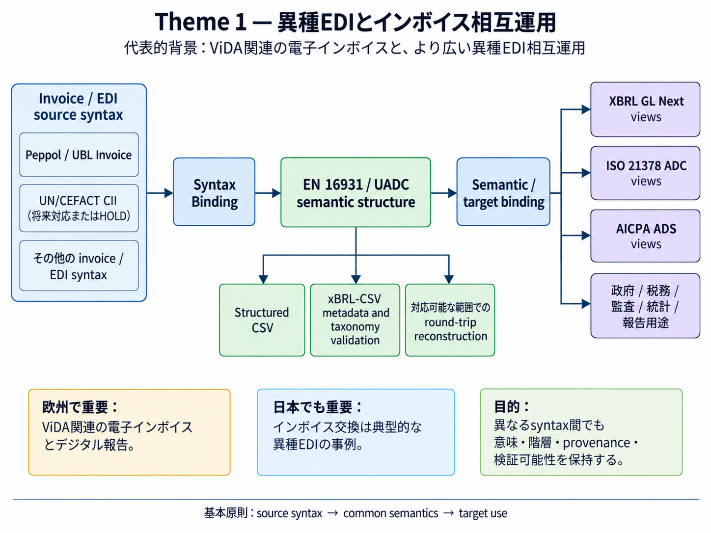
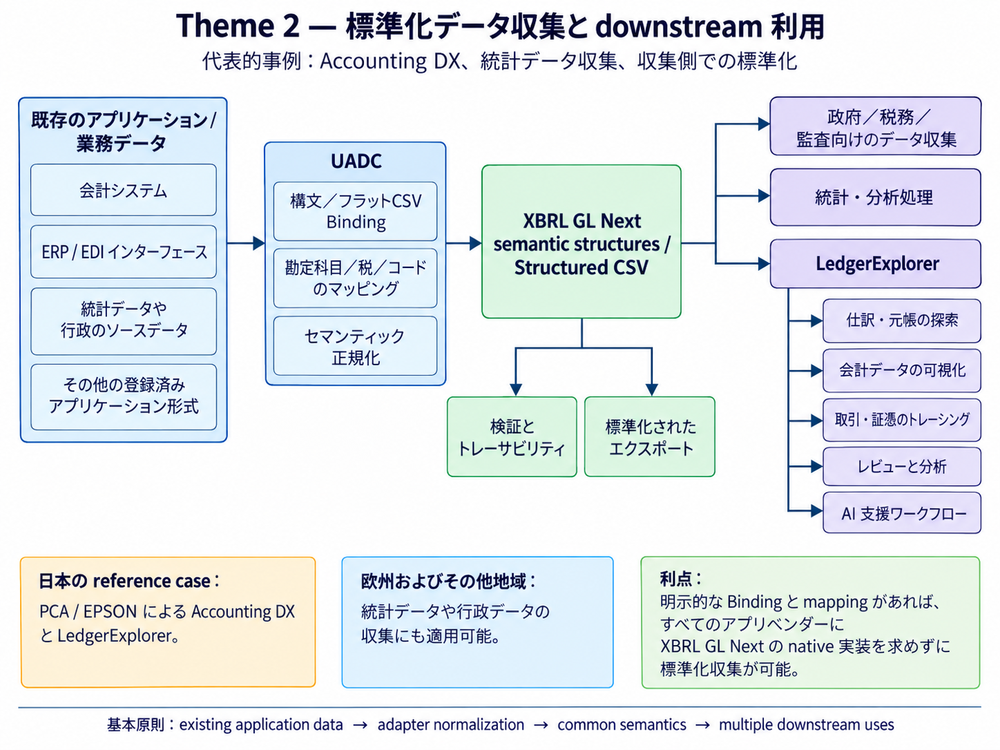

**言語:** [English](README.md) | 日本語

# UADC PoC コラボレーション・ワークスペース

このリポジトリは、**UADC（Universal Adapter for Data Conversion）**の概念実証（PoC）および **XBRL GL Next** との関係について、共同検討と実装を行うためのワークスペースです。

UADC は、業務上の意味（business semantics）を、各システム固有の構文（syntax）から分離します。個別のソース形式は、明示的な Binding 定義を介して、共通の semantic 表現および Structured CSV 表現へ接続されます。これにより、検証、報告、監査、分析、可視化その他の downstream 利用が、特定のアプリケーション固有形式へ直接依存しない構成を実現します。

UADC-PoC および同梱される XBRL GL Next taxonomy は、いずれもプロトタイプのプロジェクト成果物であり、公式仕様ではありません。採用済み taxonomy family では XBRL Japan の namespace URI を使用していますが、これは XBRL Japan または XBRL International による承認、推奨、公式公開を意味するものではありません。詳しくは、[XBRL GL source notice](taxonomy/NOTICE_XBRL_GL.md)、[licence scope](LICENSE-SCOPE.md)、[third-party notices](THIRD_PARTY_NOTICES.md)、および [publication and namespace decision](docs/decisions/ADR-XBRL-GL-NEXT-PROTOTYPE-TAXONOMY-PUBLICATION.md) を参照してください。

## プロジェクトの主要参照先

- [Current baseline](docs/CURRENT_BASELINE.md)
- [Handoff and next work](docs/HANDOFF.md)
- [Specifications](Specifications/README.md)
- [Runtime programs](tools/binding/README.md)
- [Taxonomy generator](tools/taxonomy/README.md)
- [Registered runtime cases](tests/runtime/README.md)
- [License scope](LICENSE-SCOPE.md)
- [Third-party notices](THIRD_PARTY_NOTICES.md)
- [XBRL GL source notice](taxonomy/NOTICE_XBRL_GL.md)
- [LedgerExplorer](https://github.com/pontsoleil/LedgerExplorer)

## 2つの主要適用テーマ

UADC アーキテクチャは、現在、大きく2つの適用テーマを通じて検証されています。ただし、これらは**欧州向け／日本向けという地域別テーマではありません**。どちらのテーマも欧州、日本、その他の地域で重要であり、現在は地域ごとに異なる背景や具体的な reference case が存在していると整理します。

### Theme 1 — 異種 EDI とインボイス相互運用

**Invoice PoC は、引き続き UADC の中心的なユースケースです。**

欧州では、ViDA 関連環境を含む電子インボイスおよびデジタル報告への移行が重要な背景にあります。そのため、標準化されたインボイスおよび会計情報を、政府・税務当局によるデータ収集、監査、相互運用へ再利用することの重要性が高まっています。

ただし、これは **UADC または XBRL GL Next が公式な ViDA 仕様または implementation profile であることを意味しません。**

同じテーマは日本でも重要です。インボイス交換は、複数の syntax、profile、legacy interface、アプリケーション固有形式が併存する**異種 EDI の典型例**です。基礎となる業務上の意味がほぼ同じであっても、物理形式や製品固有 interface は異なります。UADC では、Invoice PoC を欧州だけのユースケースではなく、異種 EDI の相互運用という一般的な問題の代表例として扱います。

Invoice PoC は、ソース側のインボイス構文を共通 semantic layer を介して、再利用可能な Structured CSV および XBRL 表現へマッピングする方法を示します。

### Theme 1 アーキテクチャ



目的は、単なるインボイス形式変換ではありません。ソースおよびターゲット構文が変化しても、意味、階層、provenance、検証可能性を安定して保持できることを PoC で示します。この考え方は、参加するすべてのシステムに単一の物理構文採用を求めることなく、異種 EDI を整合させる必要がある場面に広く適用できます。

### Theme 2 — 標準化データ収集と downstream 利用

第2テーマは、一国の Accounting DX に限定されません。UADC は、既存アプリケーションのデータと、標準化された XBRL GL Next / Structured CSV 表現との間に adapter layer を設け、会計、税務、監査、統計、分析、その他のデータ収集に再利用することを意図しています。

日本では、その具体的な reference case が、PCA や EPSON などを利用する税理士・会計事務所・企業の Accounting DX です。各システムのデータを共通 semantic representation に変換し、**LedgerExplorer** などの downstream application へ供給できます。

欧州では、同じアーキテクチャを、会計データだけでなく、XBRL GL Next の semantics を適用可能な**各種統計データや行政・業務データの収集**にも利用するニーズがあります。UADC の実務上の利点は、データ収集のために、すべての source application vendor に XBRL GL Next の native 対応をあらかじめ要請する必要がない点です。明示的な Binding と mapping を定義できれば、既存の export や interface を UADC で共通 semantic layer へ正規化できます。

### Theme 2 アーキテクチャ



この構成では、責務を次のように分離します。

- **Source application** — native standard interface が必要でない限り、既存の interface を継続利用できる。
- **UADC** — 明示的な Binding と mapping により、異種の source-system format を標準化された semantic data へ変換する。
- **Structured CSV / XBRL GL Next** — 共通の interchange / preservation layer を提供する。
- **Data-collection / analytical system** — すべての source vendor に同一 target interface の実装を求めることなく、標準化 layer を利用できる。
- **LedgerExplorer** — 現在の accounting-data use case における主要な reference downstream application であり、第2テーマ全体の範囲を限定するものではない。

現在の canonical provenance では、`anonymous_v17` を PCA → Structured CSV のルートとして登録し、LedgerExplorer および EPSON を downstream use として位置づけています。この fixture は現在の accounting-oriented reference route を検証するものです。より広い統計・行政データ収集は architecture 上の適用領域であり、別途登録・検証されていない限り、accepted runtime implementation であるとは主張しません。

## 現在の Canonical Baseline

canonical publication tree は **2026-09-19** に再構築されました。公開 branch では、repository root 自体が canonical publication tree であり、入れ子の `canonical/`、`transformations/`、`legacy/` directory は存在しません。

現在の canonical 構成には次が含まれます。

- runtime program: `tools/binding/`
- Binding および mapping 定義: `bindings/`
- XBRL GL Next semantic model: `models/`
- 採用済み Business Transactions / Accounting Entries taxonomy family: `taxonomy/`
- 採用済み fixture: `instances/`
- 登録済み runtime case: `tests/runtime/`
- 保守対象 specification: `Specifications/`

canonical Flat CSV Binding は、採用済みの **16-column contract** を使用します。17列ファイルは legacy-compatible input としてのみ受理され、runtime では16列 contract へ正規化されます。selector は必要に応じて `semantic_path` または `syntax_path` に保持し、canonical HMD の `semantic_path` 自体は occurrence-neutral とします。

### 現在の `anonymous_v17` accounting fixture

現在の PCA/EPSON interoperability fixture は `anonymous_v17` です。

```text
PCA anonymous_v17
  -> Structured CSV anonymous_v17
     +-> LedgerExplorer
     +-> EPSON anonymous_v17
```

登録済み canonical path は次のとおりです。

- PCA source: `instances/original/PCA/anonymous_v17/PCA.csv`
- Structured CSV: `instances/derived/PCA/anonymous_v17/structured.csv`
- EPSON derivative: `instances/derived/EPSON/anonymous_v17/EPSON.csv`

`original_basis` と `evaluation_v17_basis` は、それぞれ独立した historical fixture identity として保持され、この登録によって置き換えられるものではありません。

### 宣言済み HOLD 項目

現在の baseline では、次の項目を accepted PASS として扱いません。

- 完全な accepted exact execution set がない CII forward/reverse conversion
- dedicated OIM-to-Tuple / Tuple-to-OIM execution manifest
- EPSON-to-PCA reverse conversion
- EPSON route における PCA explicit tax amount の保存
- EPSON real-application import acceptance

これらの HOLD 項目は、明示的に宣言された範囲内で accepted route の有効性を否定するものではありません。

## Project Charter

本 PoC は、**XBRL GL Next Requirements Specification** および companion document である **XBRL GL Next Taxonomy Framework** の実装・検証プロジェクトです。framework requirements を、実行可能な Binding、semantic model、serialisation、transformation、再現可能な test へ具体化することを目的とします。

本プロジェクトでは次の原則を採用します。

- semantics を第一とし、特定の serialisation から分離する。
- semantic model は FSM（Foundational Semantic Model）、BSM（Business Semantic Model）、LHM（Logical Hierarchical Model）の層で構成する。
- 制約された semantic model から、serialisation-ready な構造を deterministic processing により導出する。
- XBRL GL Next を、EDI、ERP、会計、監査、税務、統計、reporting system を接続する Universal Adapter の core semantic dataset として扱う。
- 同一 semantics を、XBRL 2.1 palette taxonomy および xBRL-CSV を含む OIM-based serialisation で実現できるようにする。
- source-system-specific syntax は Binding 定義によって分離する。
- local extension により common meaning を暗黙に再定義しない。
- source-system conversion と downstream presentation の責務を分離する。

この charter の確認対象となった draft document set は次のとおりです。

1. **XBRL GL Next — Requirements Specification**
2. **XBRL GL Next Taxonomy Framework — Part 1: General rules**
3. **XBRL GL Next Taxonomy Framework — Part 2: XBRL 2.1 palette taxonomy**
4. **XBRL GL Next Taxonomy Framework — Part 3: xBRL-CSV palette taxonomy**
5. **XBRL GL Next Taxonomy Framework — Part 4: Aligned pool for extension**
6. **XBRL GL Next Taxonomy Framework — How to extend the taxonomy**

source document set は、この UADC-PoC publication tree の外部で管理されています。framework reference であり、自動的に配布可能な project artifact となるものではありません。

## Invoice PoC Processing Model

元来の UADC Invoice PoC は、hierarchical tidy data を共通 semantic representation として使用する考え方を示します。target architecture では、source syntax conversion と downstream audit-view generation を分離します。

- syntax binding は、source invoice XML を共通の EN 16931 / XBRL GL Next semantic layer へマッピングする。
- common semantic layer は、document-level invoice information、party、tax subtotal、invoice line、identifier、date、currency、monetary amount を保持する。
- semantic binding は、common dataset を ISO 21378 ADC や AICPA ADS などの downstream view へ投影する。
- source / target interface file は組織固有であってもよいが、common semantic structure は安定して保持する。

ADS と ISO 21378 ADC は、より広い ERP environment を前提とします。インボイス単独では、すべての audit-data field を埋めることはできません。そのため本 PoC では、invoice data から導出可能な情報と、ledger、master data、workflow log、その他 operational system から取得すべき情報を区別します。

OpenPeppol BIS Billing は、EN 16931 baseline に対する CIUS/profile layer として扱い、追加 constraint、default、syntax-specific rule を適用します。

CII development route は、accepted input、reverse output、完全な execution evidence を保存済み evidence から再構成できるまで HOLD とします。

## UADC Processing Steps — Invoice Theme

以下の phase は、project management milestone ではなく、Invoice PoC の processing model を示します。

| Phase | Processing Step | Main Inputs And Outputs | Current Status |
| --- | --- | --- | --- |
| Phase 1 | source invoice syntax から generic Structured CSV を作成する。 | Peppol UBL Invoice XML → syntax binding → EN 16931 / UADC Structured CSV → xBRL-CSV metadata and taxonomy validation → supported round trip. | **accepted PoC baseline の範囲で Complete。** |
| Phase 2 | generic Structured CSV を purpose-specific な common format へ変換する。 | Structured CSV → ADS XBRL GL、ADS PSV、ISO 21378 ADC invoice view。 | **declared PoC scope の範囲で Complete。** |
| Phase 3 | source syntax と interoperability test を拡張する。 | UN/CEFACT CII および他の invoice/XBRL GL example と対応する reverse route を追加する。 | **完全な accepted execution evidence が登録されていない範囲は HOLD / future work。** |

Phase 1 は neutral intermediate representation に焦点を当てます。Phase 2 は、その representation を複数の downstream format に再利用します。この分離が UADC の基本原則です。

## UADC Processing Steps — 標準化データ収集 Theme

このテーマでは、application / operational data の収集に対しても同じ architecture separation を適用します。現在登録されている実装例は accounting data が中心ですが、適切な XBRL GL Next semantics と Binding を定義できる他の収集領域にも同じアーキテクチャを適用することを想定しています。

| Step | Processing Step | Current Role |
| --- | --- | --- |
| 1 | 登録済み profile と Binding を使用して application-specific data を読み込む。 | 現在の主要な accounting interface 実装は PCA と EPSON。他の application / collection interface も同じ pattern を利用できる。 |
| 2 | application-specific code、dimension、classification、transaction representation を正規化する。 | mapping definition は semantic model から分離して管理する。 |
| 3 | 適用する XBRL GL Next semantic structure を Structured CSV として materialize する。 | 現在の主要な実装 reference route は Accounting Entries。他の収集構造には、それぞれ accepted model と evidence が必要。 |
| 4 | accepted round-trip、provenance、interoperability condition を検証する。 | 明示的に declared PASS の scope のみを accepted とする。 |
| 5 | 標準化データを downstream consumer に供給する。 | 現在の例には LedgerExplorer があり、他に政府、税務、監査、統計、分析の収集 process を想定できる。 |

重要な利点は、標準化を source application 自体ではなく、adapter または collection boundary で実施できることです。native XBRL GL Next 対応が望ましい場合はありますが、標準化データ収集を開始するために、すべての source application で native 対応が完了していることを前提とする必要はありません。

## Figure 1 — UADC Invoice PoC Processing Flow


Figure 1 は、もともとの **invoice-centred UADC processing flow** を示した図です。図中では **UADC Stage 1** と **UADC Stage 2** という表記を使用しています。本 README では、これらをそれぞれ下記の **Phase 1**、**Phase 2** に対応づけます。**Phase 3 は元の Figure 1 を拡張する段階であるため、Figure 1 には描かれていません。**

- **Phase 1 / UADC Stage 1 — Source-to-semantic conversion**
  現在は OpenPeppol / UBL Invoice XML を代表例とする source invoice syntax を Syntax Binding で読み込み、共通の EN 16931 / UADC hierarchical semantic representation と Structured CSV へ変換します。accepted PoC scope では、xBRL-CSV metadata、taxonomy / metadata validation、さらに対応する source syntax への round-trip reconstruction もこの phase に含みます。

- **Phase 2 / UADC Stage 2 — Semantic-to-target conversion**
  共通の Structured CSV / semantic layer を、複数の target view の共通 source として再利用します。Semantic Binding または Syntax Binding により、同じ基礎データを ISO 21378 ADC、AICPA ADS、XBRL GL、PSV 系の表現へ投影します。これにより、source conversion と downstream の reporting / audit format を分離できることを示します。

- **Phase 3 — Syntax expansion and interoperability validation**
  同じ semantic layer を中心として、UN/CEFACT CII、その他の XBRL GL / EDI 表現など、追加の source / target syntax を扱います。対応する reverse route や interoperability test も追加します。Phase 3 は元の Figure 1 には描かれておらず、完全な accepted execution evidence が登録されていない route は引き続き **HOLD** とします。

したがって、基本アーキテクチャは **source syntax → common semantics → target use** です。Figure 1 はこれを invoice data で示していますが、同じ分離原則は Theme 2 のより広い UADC 適用にも利用できます。すなわち、すべての source application に最終標準形式への native 対応を要求することなく、会計、統計、行政、その他の operational data を標準化して収集する構成です。

## Directory Layout

- **bindings/** — syntax、semantic、Structured CSV、PCA、EPSON、account、tax の Binding/mapping 定義。
- **models/** — EN CIUS invoice、XBRL GL Business Transactions、XBRL GL Accounting Entries、および関連 HMD/model input。
- **instances/** — accepted `original/`、`derived/`、`roundtrip/` fixture / output。
- **tests/** — 登録済み runtime case および focused validation material。
- **tests/runtime/** — accepted または明示的に HOLD とした runtime case の reproducibility manifest。
- **tools/binding/** — syntax、semantic、Flat CSV、Tuple、および supporting conversion program。
- **tools/taxonomy/** — taxonomy generation program、template、datatype binding、generator documentation。
- **taxonomy/** — Business Transactions / Accounting Entries 用の accepted XBRL Japan namespace taxonomy family。
- **definitions/** — model / taxonomy tooling で利用する shared definition。
- **Specifications/** — maintained public specification と `technical/` implementation definition。
- **docs/** — maintained implementation、baseline、handoff、governance documentation。
- **references/** — reproducible reference note、provenance、project figure。
- [**XBRL_GL_Next_UADC_PoC.pdf**](XBRL_GL_Next_UADC_PoC.pdf) — UADC PoC と XBRL GL Next の関係を説明する project overview document。

LedgerExplorer は Structured CSV の downstream consumer であり、UADC の source conversion responsibility には含まれないため、別リポジトリで管理します。

## Current Scope

### A. Invoice / EDI Interoperability

1. generic Structured CSV で使用する EN 16931 invoice semantic/LHM structure を定義・監査する。
2. Peppol UBL Invoice XML を generic UADC Structured CSV へ変換する。
3. accepted PoC scope の範囲で xBRL-CSV metadata と taxonomy relationship を生成・検証する。
4. accepted route について Structured CSV から UBL Invoice XML を再構成する。
5. declared ADS / ISO 21378 target view を生成する。
6. OpenPeppol BIS Billing を EN 16931 baseline 上の profile layer として維持する。
7. complete evidence により acceptance が裏付けられる場合に限り、追加 source syntax へ拡張する。
8. Invoice PoC を、欧州、日本、その他の地域における異種 EDI 相互運用の reference pattern として位置づける。

### B. Standardized Data Collection / Accounting and Statistical Use

1. 登録済み accounting-system format および他の application format を、明示的な Binding により変換する。
2. system-specific account、tax code、classification、dimension、interface mapping を canonical semantics から分離して維持する。
3. 現在の accounting route は、accepted XBRL GL Next Accounting Entries semantic model と Structured CSV により表現する。
4. 適切な Binding と mapping が存在する場合、すべての source-application vendor に native XBRL GL Next 対応を要求せず、collector side で標準化できるようにする。
5. 明示的に accepted とした scope の範囲で round-trip / interoperability behaviour を検証する。
6. `anonymous_v17` を現在の PCA/EPSON accounting interoperability fixture として使用する。
7. standardized Structured CSV を、現在の accounting use case における reference downstream visualization / tracing route として LedgerExplorer に供給する。
8. 対応する semantic model、Binding、acceptance evidence が定義された場合、同じアーキテクチャを政府、税務、監査、統計、分析のデータ収集へ拡張する。
9. 未解決の EPSON reverse conversion、explicit-tax preservation、real-application import は declared HOLD として維持する。

### C. Shared Architecture

1. semantic definition を個別の source / target syntax から独立させる。
2. Binding / mapping rule を明示的かつ reviewable に保つ。
3. Structured CSV、formal xBRL-CSV metadata、collection interface、LedgerExplorer input の責務を分離する。
4. 必要な場合、provenance と accepted exact-byte baseline を保持する。
5. canonical authoring、validation、publication control を分離する。
6. native standard support と adapter-based conversion を共存させ、どちらか一方をすべての source system に必須としない。

## Clone and Setup Overview

**canonical** publication branch を使用する場合は、その branch を明示して clone または switch します。

Windows PowerShell:

```powershell
git clone --branch canonical https://github.com/pontsoleil/UADC-PoC.git
cd .\UADC-PoC
$python = 'python'
& $python --version
```

macOS / Linux shell:

```bash
git clone --branch canonical https://github.com/pontsoleil/UADC-PoC.git
cd ./UADC-PoC
PYTHON=python3
$PYTHON --version
```

repository を既に clone 済みの場合:

```bash
git fetch origin
git switch canonical
git pull --ff-only origin canonical
```

repository には executable runtime program が含まれますが、accepted / held conversion case の authoritative reproducibility information は、この README にハードコードした command list ではありません。

次を使用します。

- [`tests/runtime/README.md`](tests/runtime/README.md) — runtime-manifest contract
- 該当する `tests/runtime/**/RUN_PARAMETERS.json` — 登録済み program、argument、working directory、HMD、Binding、input、output、checksum、accepted status

`RUN_PARAMETERS.json` manifest は既存の runtime invocation を記録するものであり、新しい runtime option や `--config` interface を作るものではありません。PASS case は、記録された runtime と material dependency が accepted evidence と一致している間のみ有効です。

この README では、canonical publication tree にすでに存在しない可能性がある historical test command を意図的に再掲していません。

## Validation and Runtime Evidence

accepted taxonomy bytes は `taxonomy/` に登録します。accepted input / output fixture は `instances/` に登録します。

runtime execution contract は、repository-root-relative path を使用して `tests/runtime/` に登録します。各 case は status を `PASS` または `HOLD` として記録し、登録処理によって prior result を accepted evidence なしに格上げしてはなりません。

case を再現する場合:

1. 該当する `tests/runtime/**/RUN_PARAMETERS.json` を選択する。
2. 記録された runtime program と material dependency が存在し、登録済み checksum と一致することを確認する。
3. 記録済み `working_directory` から、記録済み `runtime_arguments` を使用して program を実行する。
4. generated output を registered accepted output / checksum と比較する。
5. material premise が異なる、または accepted evidence が不完全な場合は HOLD を維持する。

historical documentation や test command が current canonical runtime manifest と矛盾する場合、authoritative なのは current canonical runtime manifest です。

## Semantic Path Convention

semantic path element は Business Term から `lowerCamelCaseConcatenated` で生成します。例:

```text
Invoice issue date -> invoiceIssueDate
Seller postal address -> sellerPostalAddress
```

Flat CSV Binding では、source-specific occurrence の識別に必要な selector を、現在の16-column contract に従って Binding path に表現します。canonical HMD semantic path 自体は occurrence-neutral とします。

## License

UADC-PoC では executable logic と original meaning-bearing content を分離します。

- first-party executable program logic（Python conversion、validation、generation、input/output、CLI、test-support logic を含む）は、[MIT License](LICENSE-CODE) のもとでライセンスされます。
- first-party original semantic content（LHM definition、syntax / semantic binding、join / relationship table、field mapping、transformation rule、semantic definition、Structured CSV schema、label、translation dictionary、original public sample、documentation、diagram、explanation を含む）は、[LICENSE-CONTENT](LICENSE-CONTENT) に記載のとおり [CC BY-SA 4.0](https://creativecommons.org/licenses/by-sa/4.0/) のもとでライセンスされます。
- Python その他の mixed source file では、original semantic constant、dictionary、list、table、comment、docstring は CC BY-SA 4.0 とし、それを取り囲む executable logic は MIT License とします。

third-party material は再ライセンスしません。ISO standard text、転載された EN 16931 material、AICPA ADS material、XBRL/XBRL GL、UBL、Peppol specification / sample、third-party code list は、それぞれの rightsholder の条件に従います。original UADC-PoC reference ID や mapping を CC BY-SA 4.0 で公開しても、参照先の standard text が CC BY-SA 4.0 になるわけではありません。

`out/` 配下の generated file、PDF、CSV、XML/XBRL、その他 rendered artifact は、input の権利および制約を引き継ぎます。original public sample は、third-party sample および mechanically regenerated output と区別する必要があります。real data、secret、personal data、machine-specific configuration、購入した standard text は public license scope の対象外であり、公開してはなりません。

境界規則については [LICENSE-SCOPE.md](LICENSE-SCOPE.md)、third-party source / rights については [THIRD_PARTY_NOTICES.md](THIRD_PARTY_NOTICES.md) を参照してください。
